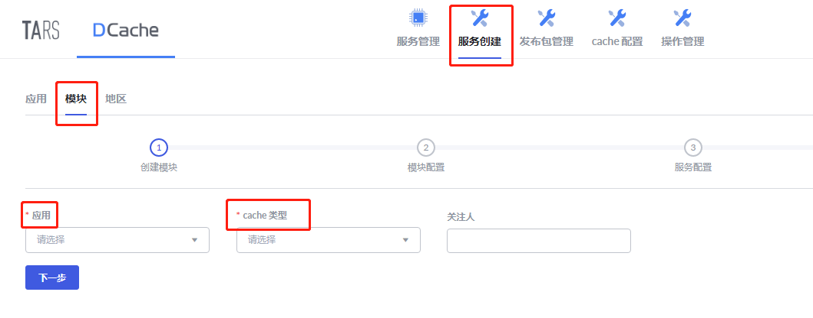

# 安装 DCache

> - [依赖环境](#1)
> - [准备工作](#2)
> - [服务部署](#3)
> - [创建一个 DCache 应用](#4)
>   - [部署和发布 Proxy 和 Router 服务](#4.1)
>   - [上线一个 KVCache 模块](#4.2)
>   - [上线一个 MKVCache 模块](#4.3)
>   - [Cache 配置管理](#4.4)

## <a id = "1"></a> 1. 依赖环境

DCache(>=2.3.0)是基于[Tars](https://github.com/TarsCloud/TarsFramework)框架（版本>=v3.0.8）, (https://github.com/TarsCloud/TarsCpp)框架（版本>=v3.0.10）开发，所以编译之前请先安装Tars开发环境和管理平台，安装步骤请参考[Tars的install文档](https://github.com/TarsCloud/Tars/blob/master/Install.zh.md)。安装完Tars管理平台后，在浏览器中访问管理平台主页，如下图：


## <a id = "2"></a> 2. 准备工作

### 2.1 编译

在源码目录执行：`mkdir build; cd build; cmake ..; make; make release; make tar`

即可生成各服务的发布包。

### 2.2 创建模板

在 Tars 的 Web 平台创建 DCache.Cache 模板，后续部署 DCache 模块时会用到该模板, 如果已经存在, 则忽略这步骤


新增模板 DCache.Cache，父模板选择 tars.default，模板内容填入：

```xml
<tars>
    <application>
        <client>
            property=DCache.PropertyServer.PropertyObj
        </client>
    </application>
</tars>
```

## <a id = "3"></a> 3. 服务部署

DCache(>=2.3.0) 支持脚本一站式部署服务!

进入 build 目录(必须在 build 下执行)

```
cd build
../deploy/install.sh DCACHE_MYSQL_IP DCACHE_MYSQL_PORT DCACHE_MYSQL_USER DCACHE_MYSQL_PASSWORD CREATE WEB_HOST WEB_TOKEN NODE_IP
```

注意:

- DCACHE_MYSQL_IP: dcache 数据库的 ip
- DCACHE_MYSQL_PORT: dcache 数据库的 port
- DCACHE_MYSQL_USER: dcache 数据库的 user
- DCACHE_MYSQL_PASSWORD: dcache 数据库的密码
- CREATE: 是否重新建表，`true` 表示重新创建 DCache 表，`false` 表示不创建
- WEB_HOST: TARS web 平台地址
- WEB_TOKEN: TARS web 平台 token(需要进入 web 平台, 用户中心上, 创建一个 Token)
- NODE_IP: 公共服务部署节点 IP, 部署完成后, 你可以在 web 平台扩容到多台节点机上

执行 install.sh 脚本后, DCache 所有基础环境就准备完毕了:

- Router、Cache、Proxy 等发布包已经上传
- DCacheOptServer/PropertyServer/ConfigServer 的配置和服务包已经上传

下一步就可以创建 DCache 的模块了.

## <a id = "4"></a> 4. 创建 DCache 应用

> 本节描述如何创建一个 DCache 应用，如何上传发布包，如何上线一个模块，并对模块进行配置。
>
> 名词解释
>
> - 模块：类似于 mysql 中 table 的概念，使用者创建一个模块来存储数据。模块分为 KVCache 和 MKVCache 两种，如果要存储 key-value 数据则创建 KVCache 模块，如果要使用 k-k-row，list，set，zset 则创建 MKVCache 模块。
> - 应用：应用是多个模块的集合，应用下所有模块共享 Proxy 和 Router 服务，类似于 mysql 中 db 的概念。

### <a id = "4.1"></a> 4.1 部署和发布 Proxy 和 Router 服务


根据上图，依次点击“服务创建”，自定义“应用”名称，然后点击“创建应用”，得到下图：


在输入框填写相关信息，其余保持不变，点击“创建 router、proxy 服务”，得到下图：


确认填写无误后，点击“安装发布”，等待安装完成，结果如下图所示：


**注意 DBAccess 服务部署也在界面中完成**

### <a id = "4.2"></a> 4.2 上线一个 KVCache 模块



按照上图箭头依次点击，“应用”选择在[部署和发布 Proxy 和 Router 服务](#5.2)创建的应用名称，“cache 类型”选择 KVCache，所填信息确认无误后，点击“下一步”进入“模块配置”步骤，如下图：


填写必要信息之后，点击“下一步”，进入“服务配置”步骤，如下图：


**注意：** <font color=red>共享内存 key 必须是唯一的，不能在服务部署机器上已存在，否则会造成服务拉起失败，可使用**ipcs**命令确认。</font>

Cache 服务的模板默认会选择 DCache.Cache，如果模板 DCache.Cache 不存在，可创建该模板或者选择其他可用的模板，模板中必须配置 property，这样才能查看服务的特性监控数据。

```xml
<tars>
    <application>
        <client>
            property=DCache.PropertyServer.PropertyObj
        </client>
    </application>
</tars>
```

必要信息填写完毕，点击“下一步”进入“安装发布”步骤，等待服务发布完成。刷新管理平台主页，左侧目录树出现此模块信息，如下图：


### <a id = "4.3"></a> 4.3 上线一个 MKVCache 模块

步骤和[部署和发布 KVCache](#5.3)类似，参考即可。

### <a id = "4.4"></a> 4.4 Cache 配置管理


按照上图箭头依次点击，可添加配置项。

#### 模块和单节点的配置管理


按照上图箭头依次点击，可在该页面上修改和添加配置。该页面的配置管理分两种类型：针对模块所有节点的配置管理和针对模块特定节点的配置管理。如果节点配置和模块配置有重叠的配置项，那么节点配置将覆盖模块配置。
**注意：** <font color=red>修改配置后，需要重启服务才能生效。</font>
